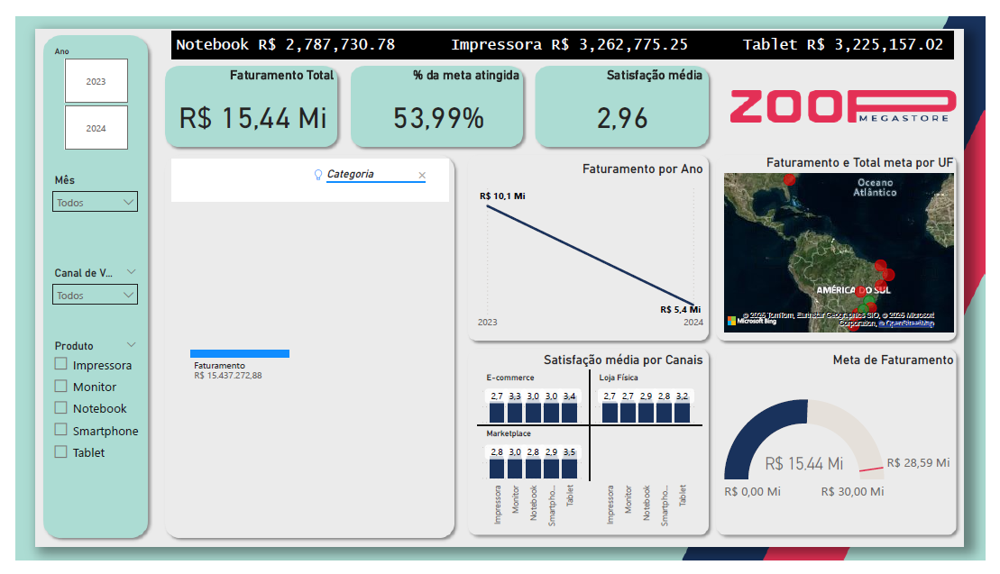
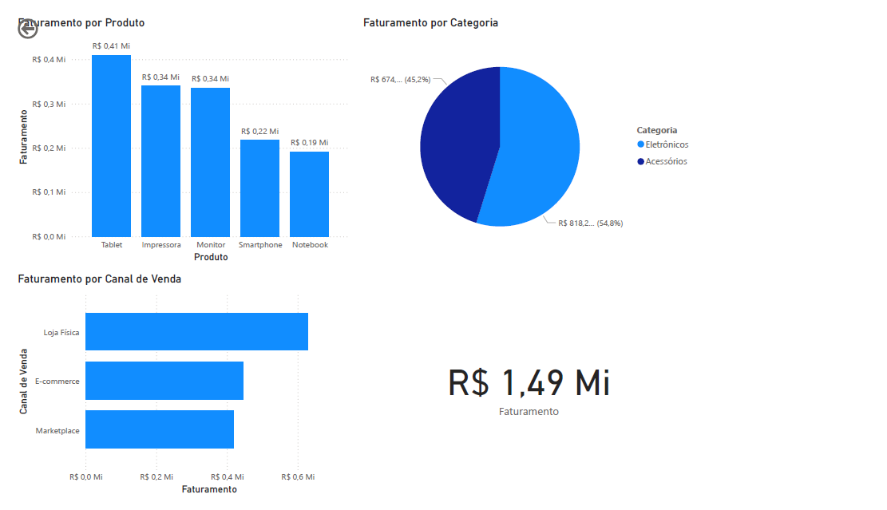

# 📊 Zoop Megastore: Dashboard Estratégico de Vendas e Satisfação

## 📝 Descrição do Projeto
Este projeto foi desenvolvido para atuar como uma ferramenta de tomada de decisão para os gestores da Zoop Megastore. O foco principal foi transformar dados brutos de vendas em um Dashboard interativo que responde a perguntas críticas de negócio, permitindo o acompanhamento de metas e a análise da satisfação do cliente.

## 🖼️ Visualização do Dashboard

### Página 1: Visão Estratégica (KPIs e Metas)

### Página 2: Detalhamento de Vendas e Canais

## ❓ Perguntas de Negócio Respondidas
1. Qual é a Receita Total, % da Meta Atingida e a Satisfação Média?
2. Evolução da Receita por dia, mês e ano.
3. Quais estados bateram a meta de vendas?
4. Satisfação média por produto dividida por canal de vendas.
5. Comportamento das vendas por categoria e produto.
6. Detalhes de vendas por estado, produto e canal.
7. Aplicação de filtros inteligentes preservando KPIs principais.

## 🛠️ Ferramentas Utilizadas
- **Microsoft Excel:** Limpeza, tratamento e estruturação da base de dados.
- **Power BI:** Modelagem de dados, criação de medidas em **DAX** e design do layout.

## 💡 Destaque Técnico
Neste projeto, utilizei a técnica de **Edição de Interações** no Power BI. Isso permitiu que os filtros de segmentação de dados afetassem os gráficos de detalhamento, mas mantivessem os cartões de Receita Total e Satisfação Geral (KPIs fixos) inalterados, servindo como uma linha de base constante para a gestão.

## 📈 Resultados
O resultado foi um relatório que une visão macro (estratégica) e visão micro (operacional), facilitando a identificação de gargalos de vendas por região.
